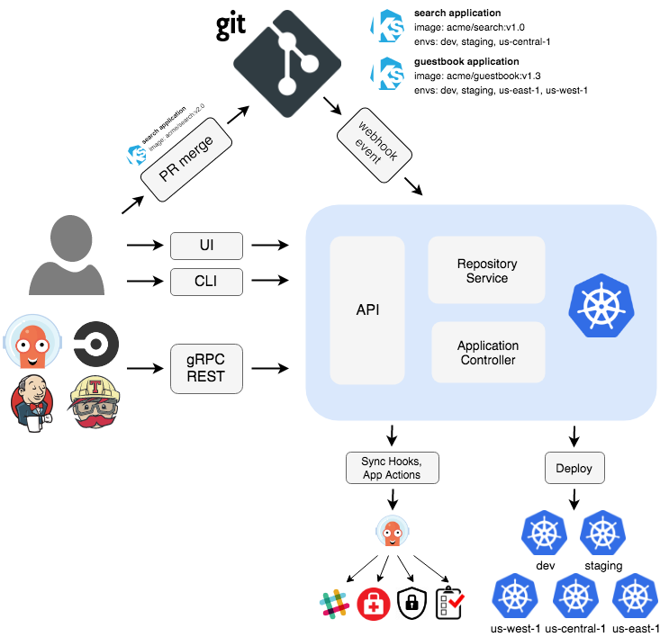

## Argo CD Architecture 

### ArgoCD consist of 3 main components
 * ArgoCD Server (API + Web Server).
 * ArgoCD Repo Server.
 * ArgoCD Application Controller.

### 1. ArgoCD Server (API + Web Server)
---
> **Its a gRPC/REST server which exposes the API consumed by the Web UI, CLI.**

* Application Mangement (Creaet, Update, Delete)
* Application Operations (ex Sync, Rollback)
* Repos & Clusters Management
* Authentication 

### 2. Repo Server 
---
> **its an internal service that responsible of cloning remote git repos & generate the needed k8s manifests**

* Clone git Repo 
* Generate k8s manifests 

### 3. Application Controller 
---
> **its a kubernetes controller which continuouly monitors running applications and compare the current, live state against the desired target state**

* communicate with repo server to get the generated manifests 
* communicates with k8s API server to get the actual cluster state 
* Deploy app manifests to destination clusters 
* Detects OutofSync Apps & takes corrective actions "if needed"
* invoking user-defined hooks for lifecycle events (PreSync, Sync, PostSync)

### Additional Components 

* **`Redis:`** used for caching 

* **`Dex:`** identity service to integrate with external identity providers 

* **`ApplicationSetController:`** it automates the genertion of Argo CD Applications

## Architecture 

